  

  <strong>Founder @ AutoMinds Africa 🇺🇬</strong> 
  Designing AI, automation and business systems that help organisations work smarter.

  <a href="https://automindsafrica.com"><strong>AutoMinds Africa</strong></a>
  &nbsp;•&nbsp;
  <a href="https://github.com/Mdanson27?tab=repositories"><strong>Repositories</strong></a>
  &nbsp;•&nbsp;
  <a href="https://github.com/Mdanson27/AUTOMINDS-AFRICA-WEBSITE"><strong>Company Engineering</strong></a>

---

## 01 / Systems profile

I’m **Mushabe Danson** — an **AI & Machine Learning builder**, systems thinker, and founder of **AutoMinds Africa**.

I focus on one question:

> **How can technology remove friction from real work?**

That leads me to build practical systems around operations, decision-making, automation and digital experiences — not technology for its own sake.

**What I build**
- 🤖 AI-assisted products and intelligent workflows
- ⚙️ Business-process and Google Workspace automation
- 🏢 Business operating systems
- 📊 Dashboards, reporting and decision-support systems
- 🌐 Premium web platforms and digital experiences
- 🔗 Connected workflows that turn repetitive work into reliable systems

 

---

## 02 / Engineering focus

| AI & Intelligence | Automation | Business Systems | Digital Products |
|---|---|---|---|
| Applied ML prototypes | Workflow orchestration | Accounting & reporting | Web platforms |
| Decision-support logic | Apps Script systems | Inventory & procurement | Smart digital identity |
| Recommendations & analysis | Notifications & approvals | Tenders & projects | Client-facing experiences |
| Practical experimentation | Repetitive-task elimination | Operational controls | Responsive UX |

---

## 03 / Selected systems

<table>
<tr>
<td width="50%" valign="top">

### 🚀 [AutoMinds Africa Website](https://github.com/Mdanson27/AUTOMINDS-AFRICA-WEBSITE)
An operating-system-inspired company experience presenting AutoMinds Africa as a builder of AI, automation and business systems.

</td>
<td width="50%" valign="top">

### 🔎 [AutoMinds Bid Finder](https://github.com/Mdanson27/AUTOMINDS-AFRICA-BID-FINDER)
A procurement intelligence platform combining a modern workspace with automated collection, normalization and bid tracking.

</td>
</tr>

<tr>
<td width="50%" valign="top">

### 🏗️ [Star Africa OS](https://github.com/Mdanson27/STAR-AFRICA)
A connected operating system spanning tenders, projects, procurement, finance, accounting and management reporting.

</td>
<td width="50%" valign="top">

### 👟 [Sylvarts Business OS](https://github.com/Mdanson27/SYLVARTS-BUSINESS-MANAGEMENT-SYSTEM)
Retail operations connecting POS, variant inventory, purchasing, customers, invoices, expenses and reporting.

</td>
</tr>

<tr>
<td width="50%" valign="top">

### 🏠 [Honest Estate Developers](https://github.com/Mdanson27/Honest-Estate-Developers-website)
A premium real-estate experience built around property discovery, brand presentation and lead generation.

</td>
<td width="50%" valign="top">

### 🛎️ [Dorah Haven Motel](https://github.com/Mdanson27/Dorah-guest-house)
A hospitality-focused digital experience with responsive booking enquiries, rooms, amenities and direct contact flows.

</td>
</tr>
</table>

---

## 04 / Precision sequence

My signature profile animation turns the idea of a contribution graph into a **precision sequence**: an archer clears active contribution targets one by one, pauses for two seconds when the sequence is complete, then resets.

  

  <em>Focus. Consistency. Execution. Systems thinking.</em>

---

## 05 / How I build

\`\`\`text
UNDERSTAND THE WORKFLOW
        ↓
IDENTIFY THE FRICTION
        ↓
REMOVE REPETITIVE WORK
        ↓
CONNECT THE DATA
        ↓
AUTOMATE THE PROCESS
        ↓
MAKE THE SYSTEM EASY TO USE
        ↓
MEASURE → LEARN → IMPROVE
\`\`\`

The goal is not more software.  
The goal is **better operations**.

---

## 06 / Technology orbit

  
  
  
  
  
  
  

---

## 07 / AutoMinds Africa

**AutoMinds Africa** builds practical technology for organisations that want to work smarter — AI-assisted tools, workflow automation, business operating systems, dashboards, smart digital identity and modern digital products.

  <strong>WORK SMARTER. NOT HARDER.</strong> 
  Kampala, Uganda 🇺🇬 · Building intelligent systems for Africa.

