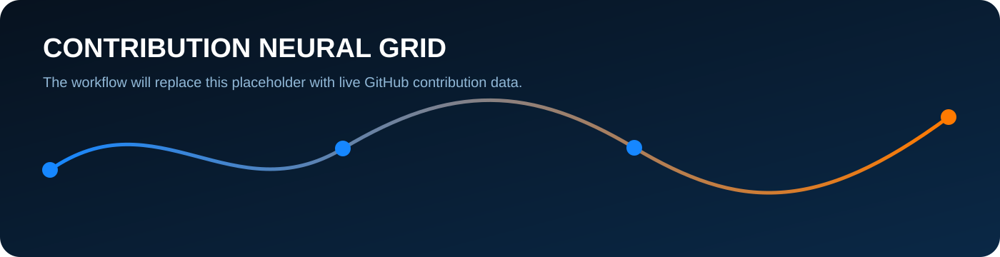

<p align="center">
  
</p>

<p align="center">
  <strong>Founder, AutoMinds Africa 🇺🇬</strong><br/>
  Building AI, automation and business systems that turn complex work into simple, scalable operations.
</p>

<p align="center">
  <a href="https://automindsafrica.com">AutoMinds Africa</a>
  ·
  <a href="https://github.com/Mdanson27/AUTOMINDS-AFRICA-WEBSITE">Company Engineering</a>
  ·
  <a href="https://github.com/Mdanson27?tab=repositories">Projects</a>
</p>

---

## `whoami`



I’m **Mushabe Danson**, an AI & Machine Learning student, builder and founder of **AutoMinds Africa** in Uganda.

I focus on systems that solve operational problems — not technology for its own sake.

**What I build**
- 🤖 AI-assisted products and intelligent workflows
- ⚙️ Business-process automation
- 🏢 Business operating systems
- 📊 Dashboards, reporting and decision systems
- 🌐 High-conversion websites and digital experiences
- 🔗 Google Workspace / Apps Script automation

<br clear="right"/>

---

## Engineering focus

| AI & Intelligence | Automation | Business Systems | Digital Products |
|---|---|---|---|
| ML prototypes | Google Apps Script | Accounting workflows | Web platforms |
| AI-assisted decision support | Workflow orchestration | Inventory & purchasing | Smart digital identity |
| Data-driven recommendations | Notifications & approvals | Tenders & project operations | Client portals |
| Applied experimentation | Google Workspace systems | Reporting & controls | Responsive UX |

---

## Flagship systems

<table>
<tr>
<td width="50%" valign="top">

### 🚀 [AutoMinds Africa Website](https://github.com/Mdanson27/AUTOMINDS-AFRICA-WEBSITE)
An operating-system-inspired company experience presenting AutoMinds as a builder of AI, automation and business systems.

</td>
<td width="50%" valign="top">

### 🔎 [AutoMinds Bid Finder](https://github.com/Mdanson27/AUTOMINDS-AFRICA-BID-FINDER)
Uganda-focused procurement intelligence combining a Next.js workspace with Python source collectors and automated bid tracking.

</td>
</tr>

<tr>
<td width="50%" valign="top">

### 🏗️ [Star Africa OS](https://github.com/Mdanson27/STAR-AFRICA)
A connected business operating system spanning tenders, projects, procurement, finance, accounting and management reporting.

</td>
<td width="50%" valign="top">

### 👟 [Sylvarts Business OS](https://github.com/Mdanson27/SYLVARTS-BUSINESS-MANAGEMENT-SYSTEM)
Retail operations prototype connecting POS, variant inventory, customers, purchasing, invoices, expenses and reports.

</td>
</tr>

<tr>
<td width="50%" valign="top">

### 🏠 [Honest Estate Developers](https://github.com/Mdanson27/Honest-Estate-Developers-website)
A premium, responsive real-estate experience with property discovery, filtering and lead-generation workflows.

</td>
<td width="50%" valign="top">

### 🛎️ [Dorah Haven Motel](https://github.com/Mdanson27/Dorah-guest-house)
A hospitality-focused web experience with responsive booking enquiries, rooms, amenities and direct contact actions.

</td>
</tr>
</table>

---

## Contribution neural grid

Instead of a contribution snake, this profile treats contributions like **nodes in a growing system**. The grid below is generated automatically from GitHub contribution data. Active days become connected circuit nodes; stronger contribution days carry more energy.

<p align="center">
  
</p>

> Every contribution is a node. The value comes from how the nodes connect into real systems.

---

## Current build philosophy

```text
UNDERSTAND THE WORKFLOW
        ↓
REMOVE FRICTION
        ↓
AUTOMATE THE REPETITION
        ↓
CONNECT THE DATA
        ↓
MAKE THE SYSTEM EASY TO USE
        ↓
MEASURE → LEARN → IMPROVE
```

---

## Technology orbit

<p align="center">
  
  
  
  
  
  
  
</p>

---

## AutoMinds Africa

**AutoMinds Africa** builds practical technology for organisations that want to work smarter: automation, AI-assisted workflows, business operating systems, dashboards, smart identity and digital products.

<p align="center">
  <strong>WORK SMARTER. NOT HARDER.</strong><br/>
  <sub>Kampala, Uganda 🇺🇬 · Building intelligent systems for Africa.</sub>
</p>
